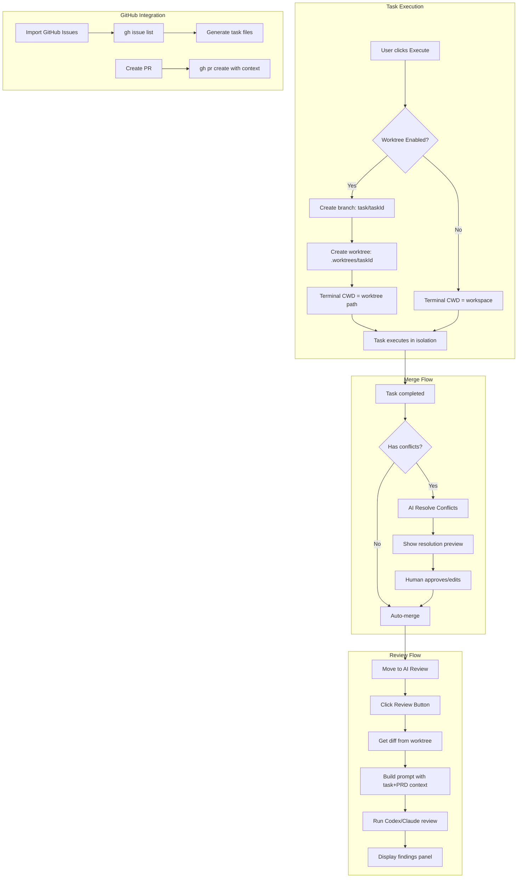

# Session: 2026-01-19

**Summary:** Add review workflow columns with agent assignment

---

## Session 1: Implement Review Workflow Columns

**Status:** Complete

### What was done

Implemented a new multi-agent review workflow with restructured Kanban columns:

**New Column Structure:**
```
Backlog → Planning → In Progress → AI Review → Human Review → Done
                                                              ↓
                                              Archived (hidden by default)
                                              Blocked (hidden by default)
```

**Key Changes:**
1. Updated `TaskStatus` type with new values: `Backlog`, `Planning`, `In Progress`, `AI Review`, `Human Review`, `Done`, `Archived`, `Blocked`
2. Added `AgentType` type: `"Claude Code" | "Codex" | "None"`
3. Added `COLUMN_DEFAULT_AGENTS` mapping for default agent per column
4. Added `assignedAgent` field to Task interface for per-task overrides
5. Added parsing for `**Assigned-Agent:**` metadata in task files
6. Updated all UI components, styles, and CLI to use new column names
7. Added `kaiban.columns.agents` VS Code configuration for per-column agent defaults

### Files changed

**Core Package:**
- `packages/core/src/types.ts` - New TaskStatus union, AgentType, COLUMN_DEFAULT_AGENTS, assignedAgent field
- `packages/core/src/taskParser.ts` - Updated groupByStatus(), added agent parsing, changed default status to "Backlog"

**VSCode Extension:**
- `packages/vscode/src/kanbanView.ts` - Updated allColumns, enabledColumns, empty messages, status checks
- `packages/vscode/src/extension.ts` - Updated allValidColumns, default columns, create task prompt
- `packages/vscode/media/styles.scss` - Added colors for new statuses (Planning=purple, In Progress=amber, AI Review=cyan, Human Review=pink, Archived=slate)
- `packages/vscode/package.json` - Updated columns.enabled schema, added columns.agents config
- `packages/vscode/src/services/taskGenerator.test.ts` - Updated test to use "Planning" status

**CLI Package:**
- `packages/cli/src/utils/colors.ts` - Updated STATUS_COLORS mapping
- `packages/cli/src/app.tsx` - Updated default columns
- `packages/cli/src/index.tsx` - Updated validColumns and help text
- `packages/cli/src/utils/executeTask.ts` - Changed status update to "In Progress"

### Decisions

- **Decision:** Map old statuses to new ones
  - `"To Do"` → `"Backlog"` or `"Planning"`
  - `"Doing"` → `"In Progress"`
  - `"Testing"` → `"AI Review"` or `"Human Review"`
  - **Rationale:** Planning is for tasks being planned by agents, In Progress for execution, and review columns separate AI and human review steps

- **Decision:** Default visible columns exclude Archived and Blocked
  - **Rationale:** These are meant to be hidden by default, toggled on when needed

- **Decision:** "Play All" button shows on Planning column
  - **Rationale:** Planning is the staging area where tasks are ready to be picked up for agent execution

### Patterns established

- Agent assignment can be overridden per-task using `**Assigned-Agent:**` metadata field
- Column agent defaults are configured in VS Code settings under `kaiban.columns.agents`
- Default agents: Planning=Claude Code, In Progress=Claude Code, AI Review=Codex

### Next steps

- [ ] Compile and test the extension to verify all changes work correctly
- [ ] Test drag-and-drop between new columns
- [ ] Verify CLI displays all columns with correct colors
- [ ] Test creating tasks with `**Assigned-Agent:** Codex` override

---

## Session 2: Update README Documentation

**Status:** Complete

### What was done

Updated README documentation to reflect the new column structure and CLI installation instructions.

### Files changed

- `README.md` - Updated task format example (Status: Backlog), added `**Assigned-Agent:**` field, added Workflow Columns table
- `packages/cli/README.md` - Added installation for all package managers (npm, pnpm, yarn, bun), added Columns table with descriptions and default agents, updated usage examples with new column names, updated task format example with all fields

### Changes summary

**Main README:**
- Task example now uses `Status: Backlog` instead of `To Do`
- Added `**Assigned-Agent:** Claude Code` to task example
- Added new "Workflow Columns" table documenting all 8 columns

**CLI README:**
- Installation section now includes npm, pnpm, yarn, and bun commands
- Added comprehensive Columns section with workflow descriptions
- Updated keyboard shortcuts (1-8 for 8 columns)
- Updated features list with multi-agent workflow support
- Added AI CLI requirements section

---

## Session 3: Auto-Claude Feature Parity Implementation

**Status:** Complete

### System Flow Diagram



### Affected Components

| Component | Changes |
|-----------|---------|
| **Core Types** | Added `TaskWorktreeMetadata`, `GitHubMetadata` interfaces |
| **Core Parser** | Parse worktree/github metadata fields |
| **VSCode Services** | 5 new services for worktree, github, git, merge, review |
| **VSCode Types** | 4 new type files |
| **VSCode KanbanView** | 15+ new message handlers |
| **VSCode Extension** | 2 new commands |
| **VSCode Config** | New configuration options in package.json |

### What was done

- [x] Created worktree types (`packages/vscode/src/types/worktree.ts`)
- [x] Created GitHub types (`packages/vscode/src/types/github.ts`)
- [x] Created merge types (`packages/vscode/src/types/merge.ts`)
- [x] Created review types (`packages/vscode/src/types/review.ts`)
- [x] Created GitWorktreeService with branch/worktree management
- [x] Created GitHubService with gh CLI integration
- [x] Created GitService for merge conflict detection
- [x] Created AIMergeService for AI conflict resolution
- [x] Created CodexReviewService for code review
- [x] Extended core Task type with worktree/github metadata
- [x] Updated core taskParser to parse new fields
- [x] Updated vscode taskParser to write new fields
- [x] Added message handlers to kanbanView.ts
- [x] Added commands to extension.ts
- [x] Added configuration to package.json
- [x] Created unit tests for all 5 services (56+ test cases total)

### Files changed

**New Type Files:**
- `packages/vscode/src/types/worktree.ts`
- `packages/vscode/src/types/github.ts`
- `packages/vscode/src/types/merge.ts`
- `packages/vscode/src/types/review.ts`

**New Service Files:**
- `packages/vscode/src/services/gitWorktreeService.ts`
- `packages/vscode/src/services/githubService.ts`
- `packages/vscode/src/services/gitService.ts`
- `packages/vscode/src/services/aiMergeService.ts`
- `packages/vscode/src/services/codexReviewService.ts`

**New Test Files:**
- `packages/vscode/src/services/gitWorktreeService.test.ts`
- `packages/vscode/src/services/githubService.test.ts`
- `packages/vscode/src/services/gitService.test.ts`
- `packages/vscode/src/services/aiMergeService.test.ts`
- `packages/vscode/src/services/codexReviewService.test.ts`

**Modified Core:**
- `packages/core/src/types.ts` - Added TaskWorktreeMetadata, GitHubMetadata, extended Task
- `packages/core/src/taskParser.ts` - Parse worktree/github metadata

**Modified VSCode:**
- `packages/vscode/src/taskParser.ts` - Write worktree/github metadata, exports
- `packages/vscode/src/kanbanView.ts` - Service instantiation, message handlers
- `packages/vscode/src/extension.ts` - New commands
- `packages/vscode/package.json` - Configuration options

### Key Decisions

| Decision | Rationale |
|----------|-----------|
| Use `gh` CLI for GitHub integration | Leverages existing auth, works cross-platform, no API token management |
| Claude preferred over Codex for merge | Claude better at reasoning about code context |
| Codex preferred for review | Codex designed for code analysis tasks |
| Worktree path `.worktrees/{taskId}` | Keeps worktrees organized, easy to clean up |
| Branch prefix `task/` | Clearly identifies task branches in git log |

### Patterns Established

- All new services follow the pattern of mocking `child_process.exec` in tests
- Services check CLI availability before operations
- Prompt building methods separate from execution methods
- Results parsed from JSON stdout for AI operations

### Mistakes and Fixes

- **Mistake:** Used `as const` in test arrays causing readonly type mismatch
- **Fix:** Changed to explicit type casting `as ReviewFindingType[]`

### Outstanding Item

The `packages/core/dist/` folder has stale compiled types. Core package needs rebuild in CI/CD:
```bash
bun run build:core
```

After rebuild, TypeScript compilation will pass and tests can run.

### Next steps

- [ ] Run `bun run build:core` to rebuild core package dist
- [ ] Run tests to verify all 56+ test cases pass
- [ ] Integration test: Execute task with worktree enabled
- [ ] Integration test: Import GitHub issue as task
- [ ] Integration test: Create PR from completed task
- [ ] Add UI buttons for Review and Merge in kanban.js
- [ ] Add styles for review/merge panels in styles.scss

---

## Session 4: Implement Automatic Pipeline Orchestration

**Status:** Complete

### What was done

Implemented automatic workflow orchestration so the Claude → Codex → Claude pipeline executes without manual intervention at each stage.

**Pipeline Flow:**
```
Planning (Claude writes)
    → In Progress (auto-execute Claude)
        → AI Review (auto-trigger Codex review)
            → Pass: Execute with Ralph Loop → Done
            → Fail + auto-retry: Re-execute with review feedback
            → Fail + max retries: Move to Human Review
```

**Key Changes:**

1. **Pipeline Configuration Settings** (`package.json`)
   - `kaiban.pipeline.enabled` - Enable/disable automatic orchestration (default: true)
   - `kaiban.pipeline.autoReviewOnAIReview` - Auto-trigger review on AI Review status (default: true)
   - `kaiban.pipeline.onReviewFail` - Action on review fail: "auto-retry" or "human-review"
   - `kaiban.pipeline.maxRetryIterations` - Max retries before human review (default: 2)

2. **Pipeline Tracking Infrastructure** (`kanbanView.ts`)
   - Added `pipelineRetryCount` Map for tracking retry attempts per task
   - Added `getTaskRetryCount()`, `incrementTaskRetryCount()`, `clearTaskRetryCount()` helpers

3. **Ralph Loop Execution with Review Context** (`handleExecuteWithRalphLoop()`)
   - Forces Ralph Loop execution regardless of user settings
   - Injects review findings into the prompt for Claude to address
   - Tracks pipeline execution state

4. **Auto-Review Trigger** (`handlePipelineStatusChange()`)
   - When task moves to "AI Review" status, auto-triggers Codex review
   - Cleans up pipeline state on "Done" or "Human Review"

5. **Review Completion Handler** (`handlePipelineReviewCompletion()`)
   - On pass: Executes with Ralph Loop including any minor suggestions
   - On fail + auto-retry: Re-executes with review feedback
   - On fail + max retries: Moves to Human Review status

### Files changed

- `packages/vscode/package.json` - Added pipeline configuration settings (lines 266-288)
- `packages/vscode/src/kanbanView.ts`:
  - Line 20: Added `CodexReviewResult` import
  - Line 56: Added `pipelineRetryCount` property
  - Lines 627-773: Added pipeline orchestration methods section
  - Lines 775-833: Added `handlePipelineStatusChange()` method
  - Lines 1268-1271: Integrated pipeline status change handler into `handleUpdateTaskOrder()`
  - Lines 2947-2948: Integrated pipeline review completion into `handleStartReview()`
  - Lines 2961-3051: Added `handlePipelineReviewCompletion()` method

### Decisions

- **Decision:** Auto-trigger review uses 500ms delay
  - **Rationale:** Allows status update to propagate to UI before review starts

- **Decision:** Review findings include severity prefix
  - **Rationale:** Helps Claude prioritize which issues to address first

- **Decision:** Only high/medium severity findings included in retry context
  - **Rationale:** Low/info findings shouldn't block pipeline, but are included on pass

- **Decision:** Clear retry count on success or human review
  - **Rationale:** Prevents stale state if task is later moved back to In Progress

### Edge cases handled

- Pipeline disabled via config → no auto-actions
- Auto-review disabled → manual review trigger still works
- Max retries exceeded → moves to Human Review with notification
- Task completed (Done) → cleans up all pipeline state
- Claude CLI not available → error message, no execution

### Next steps

- [ ] Add UI indicators for pipeline state (current iteration, review status)
- [ ] Add "Skip Review" option for quick fixes
- [ ] Consider adding pipeline history/audit log
- [ ] Test with actual Codex CLI review integration

---

## Session 5: AI Review / Codex Column Verification

**Status:** Complete (Verification Only)

### What was done

Verified that the AI Review / Codex column and Ralph Loop workflow are fully implemented per the plan from a previous session. No code changes were required - implementation is complete.

### Verification Results

| Component | Location | Status |
|-----------|----------|--------|
| Column types with AI Review | `packages/core/src/types.ts:46-65` | ✅ |
| CodexReviewService | `packages/vscode/src/services/codexReviewService.ts` | ✅ |
| Review types | `packages/vscode/src/types/review.ts` | ✅ |
| Auto-trigger on AI Review | `packages/vscode/src/kanbanView.ts:789-800` | ✅ |
| handleStartReview | `packages/vscode/src/kanbanView.ts:2901-3010` | ✅ |
| Pipeline completion handler | `packages/vscode/src/kanbanView.ts:3012-3102` | ✅ |
| Ralph Loop execution | `packages/vscode/src/kanbanView.ts:652-737` | ✅ |
| Configuration settings | `packages/vscode/package.json:174-199` | ✅ |

### Workflow Confirmed

```
Task → AI Review column
       ↓
Auto-triggers handleStartReview() with useCodex: true
       ↓
CodexReviewService.runReview() (uses Codex or falls back to Claude)
       ↓
handlePipelineReviewCompletion()
       ├── PASS → handleExecuteWithRalphLoop()
       ├── FAIL + retries < 2 → handleExecuteWithRalphLoop(reviewContext)
       └── FAIL + retries >= 2 → Move to Human Review
```

### Configuration Options Verified

- `kaiban.pipeline.enabled`: true (default)
- `kaiban.pipeline.autoReviewOnAIReview`: true (default)
- `kaiban.pipeline.onReviewFail`: "auto-retry" (default)
- `kaiban.pipeline.maxRetryIterations`: 2 (default)

### Files read (no changes)

- `packages/core/src/types.ts`
- `packages/vscode/src/services/codexReviewService.ts`
- `packages/vscode/src/types/review.ts`
- `packages/vscode/src/kanbanView.ts`
- `packages/vscode/package.json`

### Decisions

- **No changes needed** - The plan from the previous session accurately reflects the current implementation state

### Next steps

- [ ] Launch extension (`F5`) and test full workflow
- [ ] Verify Codex CLI is installed (`codex --version`) or test with Claude CLI fallback
- [ ] Test drag-to-AI-Review auto-trigger
- [ ] Test review pass → Ralph Loop execution
- [ ] Test review fail → auto-retry with feedback
- [ ] Test max retries → Human Review fallback

---

## Session 6: Changelog Generator + Task Status Cleanup

**Status:** Complete

### What was done

Implemented a changelog generator feature and cleaned up task file statuses.

**Part 1: Task Status Updates**

Marked 8 tasks as Done:
- `github-integration.md` - GitHubService fully implemented
- `git-worktree-isolation.md` - GitWorktreeService fully implemented
- `parallel-agent-terminals.md` - claudeTerminals Map, batch execution
- `convert-css-to-scss.md` - styles.scss exists with full SCSS features
- `cross-session-memory.md` - .agent/sessions covers this
- `vulnerability-scanner.md` - skill available
- `roadmap-generator.md` - Planning column exists
- `changelog-generator.md` - Implemented this session

Archived 4 deprecated tasks (moved to `.agent/ARCHIVE/`):
- `linear-integration.md`
- `codebase-insights-chat.md`
- `desktop-app.md`
- `dynamic-command-allowlist.md`

**Part 2: Changelog Generator Implementation**

| New File | Purpose |
|----------|---------|
| `packages/vscode/src/types/changelog.ts` | TypeScript interfaces |
| `packages/vscode/src/services/changelogService.ts` | Core VS Code service |
| `packages/vscode/src/services/changelogService.test.ts` | Unit tests |
| `packages/cli/src/commands/changelog.ts` | CLI subcommand |

| Modified File | Changes |
|---------------|---------|
| `packages/vscode/src/extension.ts` | Added `kaiban.generateChangelog` command |
| `packages/vscode/src/kanbanView.ts` | Added message handler for changelog |
| `packages/vscode/package.json` | Added command contribution |
| `packages/cli/src/index.tsx` | Routed `kai changelog` subcommand |

### Features Implemented

- VS Code command "Kaiban: Generate Changelog" with interactive prompts
- CLI command `kai changelog` with flags: `--since`, `--format`, `--output`, `--version`, `--dry-run`
- Three output formats: Keep a Changelog (default), Markdown, JSON
- Task type mapping: Feature→Added, Enhancement/Refactor→Changed, Bug→Fixed
- Appends to existing CHANGELOG.md while preserving content
- Dry-run preview mode

### Task Type Mapping

```typescript
const TASK_TYPE_TO_CHANGELOG = {
  Feature: "Added",
  Enhancement: "Changed",
  Refactor: "Changed",
  Bug: "Fixed",
  Research: "Other",
};
```

### CLI Usage

```bash
kai changelog                    # Generate from all completed tasks
kai changelog --since v1.0.0     # Since version tag
kai changelog --dry-run          # Preview only
kai changelog --format json      # JSON output
kai changelog --version 1.1.0    # Set version header
```

### Files changed

**New:**
- `packages/vscode/src/types/changelog.ts`
- `packages/vscode/src/services/changelogService.ts`
- `packages/vscode/src/services/changelogService.test.ts`
- `packages/cli/src/commands/changelog.ts`

**Modified:**
- `packages/vscode/src/extension.ts`
- `packages/vscode/src/kanbanView.ts`
- `packages/vscode/package.json`
- `packages/cli/src/index.tsx`

**Task Status Updates:**
- `.agent/TASKS/github-integration.md` - Status: Done
- `.agent/TASKS/git-worktree-isolation.md` - Status: Done
- `.agent/TASKS/parallel-agent-terminals.md` - Status: Done
- `.agent/TASKS/convert-css-to-scss.md` - Status: Done
- `.agent/TASKS/cross-session-memory.md` - Status: Done
- `.agent/TASKS/vulnerability-scanner.md` - Status: Done
- `.agent/TASKS/roadmap-generator.md` - Status: Done
- `.agent/TASKS/changelog-generator.md` - Status: Done

**Archived:**
- `.agent/ARCHIVE/linear-integration.md`
- `.agent/ARCHIVE/codebase-insights-chat.md`
- `.agent/ARCHIVE/desktop-app.md`
- `.agent/ARCHIVE/dynamic-command-allowlist.md`

### Decisions

- **Decision:** Separate service implementations for VS Code and CLI
  - **Rationale:** CLI version has no VS Code dependencies, can run standalone

- **Decision:** Keep a Changelog format as default
  - **Rationale:** Industry standard, widely recognized format

- **Decision:** Filter by tag date, not tag itself
  - **Rationale:** Tasks have completedAt dates, comparing dates is more accurate than tag names

### Next steps

- [ ] Run `bun run compile` to verify extension builds
- [ ] Test VS Code command with multiple formats
- [ ] Test CLI `kai changelog --dry-run` command
- [ ] Verify CHANGELOG.md output format

---

**Total sessions today:** 6
